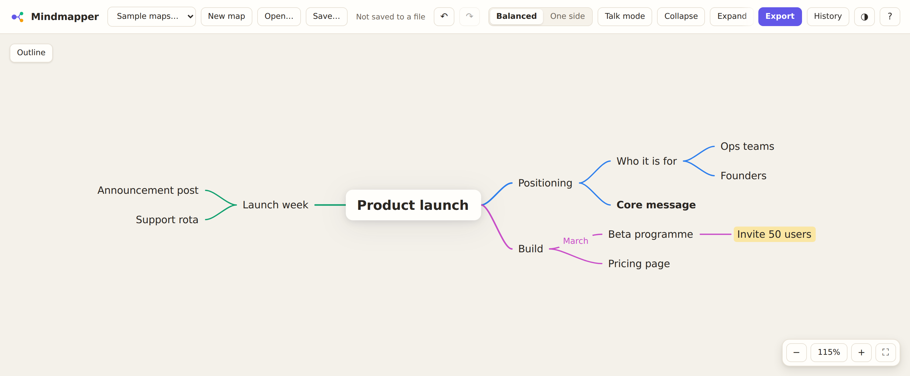
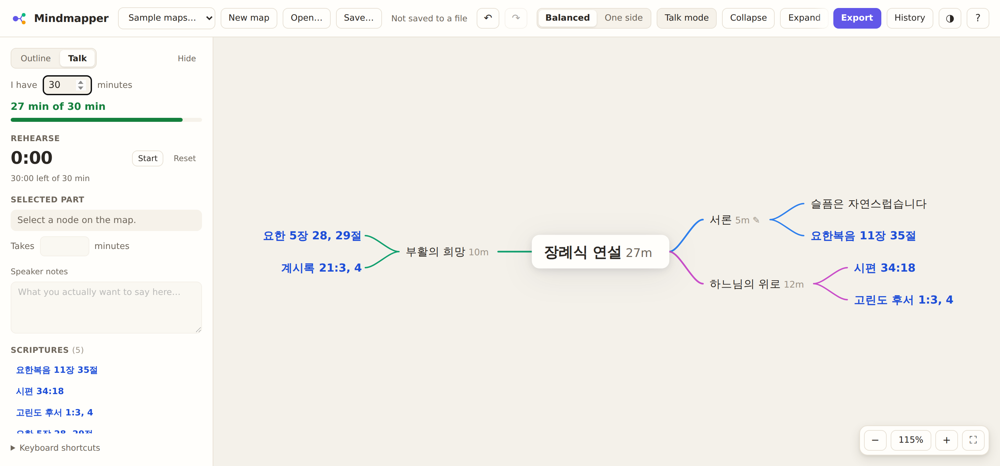

# Mindmapper

Write an outline, get a clean mind map you can keep editing on the canvas.
Colour lives in the connectors rather than in boxes, so the words stay the most
legible thing on screen.



No build step, no dependencies, no account, no server doing the thinking — it
is plain ES modules, SVG and CSS, and your maps are files on your own disk. It
works offline once loaded, and it is equally at home with a keyboard or a
touchscreen.

There is also a **Talk mode** for preparing a talk you will stand up and give:
timings, speaker notes, a rehearsal timer, and scripture references recognised
in English or Korean. It is optional — ignore it and this is an ordinary mind
mapper.

## Getting started

```bash
git clone https://github.com/Glowing-Plum/mindmapper.git
cd mindmapper
npm start          # serves the app at http://localhost:4173
```

Nothing is installed — there are no dependencies. ES modules need a real
origin, so open the served URL rather than the file itself.

On macOS you can double-click **`start.command`** instead: it starts the server
and opens your browser. The first time, macOS may block it — right-click the
file, choose **Open**, then **Open** again. Leave the Terminal window open
while you work, and close it (or press <kbd>Ctrl</kbd> + <kbd>C</kbd>) to stop.

To use it on a phone or tablet, or on a machine you would rather not run a
server on, host it — see [Putting it on the web](#putting-it-on-the-web).

```bash
npm test               # 105 unit tests: parser, model, layout, scripture, timings, files
npm run test:browser   # 99 end-to-end checks in Chromium (needs playwright)
```

## Generating a map

Paste an outline into the left panel and press **Generate map** (or
<kbd>Ctrl</kbd>/<kbd>⌘</kbd> + <kbd>Enter</kbd>). Markdown headings, bullets,
numbered lists and plain indentation all work, and the indent unit is inferred,
so 2-space, 4-space and tab outlines are all understood:

```markdown
# Product launch
- Positioning
  - Who it is for
  - Core message
- Build
  - Beta programme
```

A single top-level item becomes the root; several top-level items get a root
wrapped around them. Editing the map keeps the panel in sync, so the outline is
always a faithful text version of what you see.

You do not have to start from an outline — press **New map** and build it on the
canvas instead.

## Editing on the canvas

| Key | Action |
| --- | --- |
| <kbd>Tab</kbd> | Add a child and start typing |
| <kbd>Enter</kbd> | Add a sibling |
| <kbd>F2</kbd> or double-click | Edit the selected node |
| Arrow keys | Move the selection along the branches |
| <kbd>Alt</kbd> + <kbd>↑</kbd>/<kbd>↓</kbd> | Reorder among siblings |
| <kbd>Alt</kbd> + <kbd>←</kbd>/<kbd>→</kbd> | Outdent / indent |
| <kbd>Ctrl</kbd>/<kbd>⌘</kbd> + <kbd>B</kbd> / <kbd>I</kbd> | Bold / italic |
| <kbd>Ctrl</kbd>/<kbd>⌘</kbd> + <kbd>H</kbd> | Cycle the text highlight |
| <kbd>Ctrl</kbd>/<kbd>⌘</kbd> + <kbd>L</kbd> | Label the line coming into this node |
| Hold <kbd>Space</kbd> + drag | Pan from anywhere, even over a node |
| <kbd>.</kbd> | Collapse or expand (the bubble counts what is hidden) |
| <kbd>Delete</kbd> | Delete the node and its subtree |
| <kbd>Ctrl</kbd>/<kbd>⌘</kbd> + <kbd>Z</kbd> | Undo (add <kbd>Shift</kbd> to redo) |
| <kbd>Shift</kbd> + <kbd>F</kbd> | Fit the map on screen |
| <kbd>?</kbd> | Shortcut help |

**A card grows as you type.** It widens with the text up to the width the map
wraps at, then grows taller — and it grows away from the side it is anchored
on, so the words under your cursor stay put. The size while you type is the
size it settles at, so nothing jumps when you finish.

**Two handles** are how you branch off a card: the one out to the side adds a
child, the one underneath adds a sibling. They show while a node is selected or
being typed in, and they follow the card as it grows under your cursor. They
take the colour of the branch they would extend. Further out again sits the
button that closes the branch — and once closed, it becomes the bubble counting
what is tucked away.

**Drag a card anywhere.** Dropping on the middle of a node adds it to that
node's children; dropping near a node's top or bottom edge places it directly
above or below, with a line showing exactly where it will land — that is how
you order a card among its siblings, at any depth. Moves that would put a node
inside its own subtree are refused.

Scroll or drag empty space to pan, or hold <kbd>Space</kbd> and drag from
anywhere. <kbd>Ctrl</kbd>/<kbd>⌘</kbd> + scroll, or pinch, to zoom.

**Typing in Korean, Japanese or Chinese works properly.** Those languages go
through an input method, where keystrokes build up a syllable that is not text
yet. A key pressed mid-syllable belongs to the input method, so <kbd>Tab</kbd>
and <kbd>Enter</kbd> let it finish rather than committing the card underneath
it.

### Formatting and line labels

The toolbar above a selected node carries **bold**, *italic*, a text highlight
(four tints, click the active one again to clear it) and the branch colour —
click the active swatch again to go back to inheriting from the branch.

Any connector can carry a label: select the node below it and press **Label
line**, or double-click the line itself. The column shifts outward to make room,
so a labelled line never runs short of space.

## Your maps are files

Use <kbd>Ctrl</kbd>/<kbd>⌘</kbd> + <kbd>O</kbd> (or **Open…**) to open a map,
and <kbd>Ctrl</kbd>/<kbd>⌘</kbd> + <kbd>S</kbd> to save it. You can also drag a
file onto the canvas to open it. The top bar shows the current file, with a dot
when there are unsaved changes.

- **`.json`** is the full format: text, formatting, highlights, branch colours,
  collapse state, line labels, timings and speaker notes. Use it for maps you
  will come back to.
- **`.md`** is a plain outline — portable, but it carries the text only.

In Chrome and Edge, saving writes back to the file you opened, so it behaves
like any desktop app. Firefox and Safari have no such API, so there the button
reads **Save a copy** and each save downloads a fresh file.

Keeping maps as files means they live wherever you put them — a synced folder,
a backup, version control — rather than inside one browser.

### Keeping your work

- **Autosave.** Every change is written to `localStorage`, along with your theme
  and layout choice, and restored on the next visit.
- **Version history.** Timestamped snapshots are kept automatically (a run of
  quick edits collapses into one entry, so the list stays readable). Open
  **History** to see them with their node counts and restore any of them — the
  restore is itself undoable.
- **Checkpoints before destructive steps.** Starting a new map or regenerating
  from the outline pins the previous state in history first, and asks before
  wiping a map outright.
- **Undo survives everything.** Replacing, regenerating and restoring are all
  ordinary undoable edits.
- **Formatting is never lost to a regenerate.** The outline carries text only,
  so when you regenerate, highlights, bold, colours, collapse state and line
  labels are re-applied by matching nodes on their path.

## Talk mode

Turn it on with **Talk mode** (<kbd>Ctrl</kbd>/<kbd>⌘</kbd> + <kbd>T</kbd>).



**Timings tell you whether it fits.** Give any part a length in minutes. A
parent with no time of its own adds up its children, so you can plan top-down
("10 minutes for this section"), bottom-up, or mix the two — an explicit time
on a section always wins over the sum of its parts. Set the time you have and
the panel shows where you stand, flagging both over-running and not filling
the slot.

**Speaker notes** live on any node, marked with ✎ on the map. Minutes and notes
save as you type — no Enter needed. A run of keystrokes folds into a single
undo step, and an edit always lands on the node you were typing into, even if
you click away mid-word.

**A rehearsal timer** counts up while you practise and says how much of your
slot is left, turning amber near the end and red once it is spent. While it
runs it also shows at the top of the canvas, so you can watch the map instead
of the panel.

### Scripture references

References are recognised wherever they appear in a node, in English or Korean,
full names or abbreviations:

| Written | Read as |
| --- | --- |
| `John 3:16`, `1 Cor 13:4-7`, `Gen. 1:1` | the usual English forms |
| `시편 34:18`, `요한복음3:16` | Korean, with or without a space |
| `요한복음 17장 3절`, `시편 83편 18절` | the Korean chapter and verse markers |
| `시편 23편` | a whole chapter |
| `마태 24:14`, `로마 12:2`, `계시록 21:3, 4` | short names |
| `고린도 전서 13:4-8`, `요한 1서 5:3` | spaced numbered books |
| `다니엘서 2:44` | a trailing 서 |
| `유다 20, 21`, `Philemon 4, 5` | verses of a one-chapter book, not chapters |

A reference written **on a connector** counts too — only the reference takes
the reference colour, the rest of the label stays the colour of its line.

They are set apart on the map and collected into an index in the Talk panel,
which lists each one **as you wrote it**: the canonical English form is only
used to build the link, so a Korean outline stays Korean on screen. The index
starts folded away, so the speaker notes above it get the room; open it when
you want the list.

**Tapping a verse opens it.** References become the eight-digit number jw.org
and JW Library both use — two digits of book, three of chapter, three of verse,
so 시편 34:18 becomes `19034018`, and a range becomes a pair — and are handed to
the app as `jwlibrary:///finder?bible=…`. No language is sent: JW Library
opens the verse in whichever Bible it is already set to.

A browser is never told whether an app took a link like that, so the handoff
always comes with a way through to **jw.org** in the same tap. Where JW Library
is not installed — a Mac, for instance — switch *Tapping a verse* to **Open
jw.org in a new tab**, which is where you choose a language. A **Custom link** option takes any address with `{ref}`,
or `{bible}` and `{locale}`, if you would rather use something else entirely,
which is also the way to correct an address shape or a language code that does
not suit you.

There is a **Print / PDF outline** too: the whole talk as text, with its
timings, notes and references, for the lectern.

## Putting it on the web

A tablet cannot run the local server, so host the app instead. It is static
files, so **GitHub Pages** does it for nothing:

1. In your fork, go to **Settings → Pages**.
2. Under *Build and deployment*, set **Source: Deploy from a branch**, then
   **Branch: `main`** and **folder: `/ (root)`**, and press Save.
3. A minute later it is live at `https://<user>.github.io/<repo>/`.

Open that on the device, then **Share → Add to Home Screen**. It gets an icon,
opens without the browser's chrome, and — because the app registers a service
worker — **keeps working with no connection** once it has loaded. Pushing to
`main` updates it; the new version is picked up on the next load.

On iPad, *Open…* reads from the Files app, so maps kept in iCloud Drive are
available on every device. Safari has no file-handle API, so **Save a copy**
writes a new file to Files rather than overwriting in place.

The app is touch-first as well as keyboard-first: tap to select, double-tap to
edit, drag a node to re-parent it, drag the background to pan, pinch to zoom,
and use the toolbar above a selected node where there is no keyboard.

## Layout

Branches fan out either side of a centred root (**Balanced**) or all to the
right (**One side**).

Children are positioned relative to **their own parent**, not in global
per-depth columns. Siblings share a leading edge with each other and with
nothing else, so two nodes lining up vertically always means they belong to the
same parent — cousins under differently sized parents deliberately do not align,
because that would imply a relationship that is not there.

Every subtree is stacked so no two nodes overlap and each parent sits centred on
its children. A connector resolves its curve immediately at the parent and then
runs straight into the child; a child level with its parent gets a dead-straight
line.

## Exporting

**PNG** (2× resolution), **SVG**, **Markdown outline**, **JSON**, or the outline
straight to the clipboard. The SVG is standalone: the current theme's colours
and the typography are written into the file, so it renders the same outside the
app.

## How it fits together

| File | Responsibility |
| --- | --- |
| `src/model.js` | The tree, editing operations, formatting, undo/redo, change events |
| `src/parser.js` | Outline → tree and back (`parseOutline`, `toOutline`) |
| `src/measure.js` | Text measurement and wrapping; falls back to an estimate without a canvas |
| `src/layout.js` | Tidy two-sided layout: positions, connector paths, bounds |
| `src/render.js` | Keyed SVG rendering, so relayouts tween instead of jumping |
| `src/viewport.js` | Pan, zoom, pinch, fit-to-screen |
| `src/editor.js` | The textarea floated over the node or label being edited |
| `src/storage.js` | Autosave and the rolling version history |
| `src/files.js` | Opening and saving real files, with a fallback for browsers without file handles |
| `src/scripture.js` | Recognising scripture references, in English and Korean, and linking them |
| `src/timing.js` | Talk timings: per-part minutes, roll-up and how it compares with your slot |
| `src/exporters.js` | SVG/PNG/Markdown/JSON output and downloads |
| `src/app.js` | Interaction state and wiring |
| `sw.js` | Service worker: caches the app shell so it runs offline |
| `manifest.webmanifest` | Makes the app installable to a home screen |

`model.js`, `parser.js`, `measure.js` and `layout.js` have no DOM dependency,
which is why the layout engine can be unit-tested in Node — including the
invariant that no two nodes ever overlap.

### Tests

`npm test` runs **105 unit tests** across the parser, the document model, the
layout engine, scripture detection, talk timings, file handling and local
storage — including the invariants that nodes never overlap, that siblings align
only with each other, that regenerating preserves formatting, and that a `.json`
file round-trips everything an outline cannot carry.

`npm run test:browser` boots the app in Chromium for **99 end-to-end checks**:
editing, dragging, formatting, line labels, collapsing, undo, version history,
opening and saving files, drag-and-drop, talk mode, timings, the scripture
index, the printable outline, space-to-pan, the node handles, the rehearsal
timer, the JW Library handoff, autosave and export — plus verse taps under touch
emulation at iPad size, and Korean typed through a real input method. It skips
itself cleanly when Playwright is not installed.

## Browser support

Any current browser with ES modules and `<dialog>`: Chrome, Edge, Firefox and
Safari 15.4 or newer, on desktop, tablet and phone.

## Licence

MIT.
